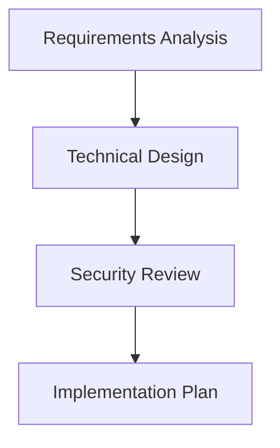
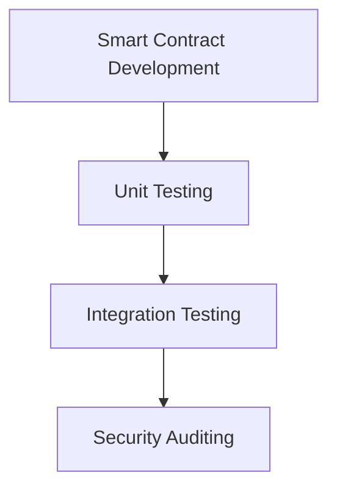
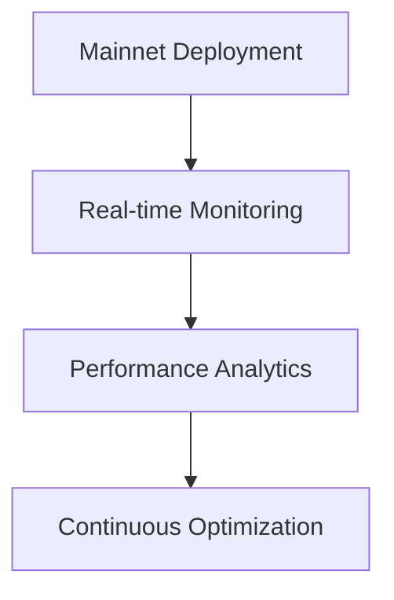

<!-- AP3X Professional Profile -->
<div align="center">
  
</div>

<div align="center">


</div>

---

## 🎯 **Supercharge Your Blockchain Projects**
### *The Complete DeFi Development Solution*

<table width="100%">
<tr>
<td width="60%" valign="top">

**Transform your blockchain vision into production-ready protocols.** I specialize in building secure, high-performance DeFi applications that handle millions in TVL while maintaining sub-100ms response times.

### 🚀 **What I Deliver**
- **Smart Contract Architecture** - Rust/Anchor frameworks optimized for Solana
- **DeFi Protocol Design** - From AMMs to lending platforms
- **Security-First Development** - Comprehensive auditing and testing
- **Performance Optimization** - Gas efficiency and transaction speed
- **Full-Stack Integration** - Frontend to blockchain connectivity

</td>
<td width="40%" valign="top">

### 📊 **Track Record**
```
🏆 $10M+ TVL Secured
🎯 50+ Smart Contracts Deployed
⚡ 20+ DApps in Production
🔒 Zero Security Incidents
📈 99.9% Uptime Achieved
```

### 🎖️ **Certifications**
- Solana Certified Developer
- Ethereum Smart Contract Auditor
- AWS Solutions Architect
- Rust Programming Expert

</td>
</tr>
</table>

---

## 🛠️ **Technology Mastery**

<div align="center">

### **Blockchain Ecosystem**

<table>
<tr>
<td align="center" width="25%">

<br><strong>Primary Focus</strong>
<br>Advanced Rust/Anchor
</td>
<td align="center" width="25%">

<br><strong>Smart Contracts</strong>
<br>Solidity/Vyper
</td>
<td align="center" width="25%">

<br><strong>Systems Programming</strong>
<br>Performance Critical
</td>
<td align="center" width="25%">

<br><strong>Full-Stack</strong>
<br>Web3 Integration
</td>
</tr>
</table>

### **Infrastructure & DevOps**

<table>
<tr>
<td align="center" width="20%">

<br>Cloud Architecture
</td>
<td align="center" width="20%">

<br>Containerization
</td>
<td align="center" width="20%">

<br>Database Design
</td>
<td align="center" width="20%">

<br>API Development
</td>
<td align="center" width="20%">

<br>Caching Layer
</td>
</tr>
</table>

</div>

---

## 🏆 **Featured Projects & Case Studies**

### 🎰 **Solana Casino - High-Performance DeFi Gaming**

<table>
<tr>
<td width="50%">

[](https://github.com/AP3X-Dev/Solana-Casino)

**🎯 Challenge:** Build a provably fair gaming platform handling high-frequency transactions

**⚡ Solution:** Custom Rust programs with optimized state management

</td>
<td width="50%">

### 📈 **Performance Metrics**
- **TVL:** $500K+ locked value
- **Users:** 10,000+ active players
- **Latency:** <100ms transaction time
- **Throughput:** 1000+ TPS capability
- **Security:** Multi-signature treasury

### 🔧 **Technical Stack**
- Anchor Framework (Rust)
- React + TypeScript Frontend
- WebSocket Real-time Updates
- Chainlink VRF Integration

</td>
</tr>
</table>

### 💬 **SOL Chat - Decentralized Communication Protocol**

<table>
<tr>
<td width="50%">

[](https://github.com/AP3X-Dev/SOL-CHAT)

**🎯 Challenge:** Create censorship-resistant messaging with NFT access control

**⚡ Solution:** On-chain message routing with client-side encryption

</td>
<td width="50%">

### 🔒 **Security Features**
- End-to-end encryption
- NFT-gated channel access
- Decentralized message storage
- Zero-knowledge proofs
- Multi-chain compatibility

### 🌐 **Network Effects**
- Cross-chain messaging
- Token-gated communities
- Reputation systems
- Governance integration

</td>
</tr>
</table>

---

## 📊 **Development Analytics & Performance**

<div align="center">

<table>
<tr>
<td width="50%">


</td>
<td width="50%">


</td>
</tr>
</table>


### 🎯 **Code Quality Metrics**


</div>

---

## 🔧 **Development Process & Methodology**

<table>
<tr>
<td width="33%" align="center">

### 🎯 **Planning & Architecture**

- Comprehensive requirement gathering
- Scalable architecture design
- Security-first approach
- Performance optimization planning

</td>
<td width="33%" align="center">

### ⚡ **Development & Testing**

- Test-driven development (TDD)
- Continuous integration/deployment
- Automated security scanning
- Performance benchmarking

</td>
<td width="33%" align="center">

### 🚀 **Deployment & Monitoring**

- Zero-downtime deployments
- Real-time performance monitoring
- Automated alerting systems
- Continuous optimization

</td>
</tr>
</table>

---

## 💼 **Service Offerings & Pricing**

<div align="center">

### 🎯 **Choose Your Development Package**

</div>

<table>
<tr>
<td width="33%" align="center">

### 🥉 **Smart Contract Audit**
**$5,000 - $15,000**

✅ **Comprehensive Security Review**
- Manual code analysis
- Automated vulnerability scanning
- Gas optimization recommendations
- Detailed audit report

✅ **Deliverables**
- Security assessment document
- Vulnerability remediation guide
- Gas optimization report
- Re-audit after fixes

**⏱️ Timeline: 1-2 weeks**

</td>
<td width="33%" align="center">

### 🥈 **DeFi Protocol Development**
**$25,000 - $75,000**

✅ **Complete Protocol Build**
- Smart contract architecture
- Frontend application
- Backend infrastructure
- Testing & deployment

✅ **Advanced Features**
- Multi-signature security
- Governance mechanisms
- Yield farming capabilities
- Cross-chain compatibility

**⏱️ Timeline: 6-12 weeks**

</td>
<td width="33%" align="center">

### 🥇 **Enterprise Blockchain Solution**
**$100,000+**

✅ **Full-Scale Development**
- Custom blockchain protocols
- Enterprise-grade security
- Scalable infrastructure
- 24/7 support & maintenance

✅ **Premium Services**
- Dedicated development team
- Priority support
- Custom integrations
- Long-term partnership

**⏱️ Timeline: 3-6 months**

</td>
</tr>
</table>

---

## 🎓 **Knowledge Sharing & Community**

<table>
<tr>
<td width="50%">

### 📚 **Technical Articles & Tutorials**
- [Building Secure DeFi Protocols on Solana](https://dev.to/ap3x)
- [Advanced Rust Patterns for Blockchain](https://medium.com/@ap3x)
- [Gas Optimization Techniques](https://blog.ap3x.dev)
- [Cross-Chain Bridge Architecture](https://docs.ap3x.dev)

### 🎤 **Speaking & Workshops**
- **Solana Breakpoint 2024** - "DeFi Security Best Practices"
- **EthDenver 2024** - "Cross-Chain Protocol Design"
- **Rust Conference** - "Performance Optimization in Blockchain"

</td>
<td width="50%">

### 🤝 **Open Source Contributions**
[](https://github.com/AP3X-Dev)

### 🌟 **Community Impact**
- **500+** developers mentored
- **50+** open-source contributions
- **25+** protocol reviews completed
- **10+** hackathon wins

</td>
</tr>
</table>

---

## 📞 **Let's Build Something Amazing Together**

<div align="center">

### 🚀 **Ready to Transform Your Blockchain Vision?**

<table>
<tr>
<td width="50%" align="center">

### 📧 **Business Inquiries**
[](mailto:contact@ap3x.dev)

[](https://calendly.com/ap3x-dev)

**Response Time: <24 hours**

</td>
<td width="50%" align="center">

### 🌐 **Connect & Follow**
[](https://github.com/AP3X-Dev)
[](https://twitter.com/AP3X_Dev)
[](https://linkedin.com/in/ap3x-dev)
[](https://discord.gg/ap3x)

</td>
</tr>
</table>

### 💡 **What You Get When Working With Me**

```
✅ Production-ready code with comprehensive testing
✅ Security-first development approach
✅ Performance optimization and gas efficiency
✅ Complete documentation and knowledge transfer
✅ Post-launch support and maintenance
✅ Direct communication and regular updates
```

---


**⚡ Powered by Innovation • Secured by Blockchain • Driven by Excellence ⚡**

</div>
