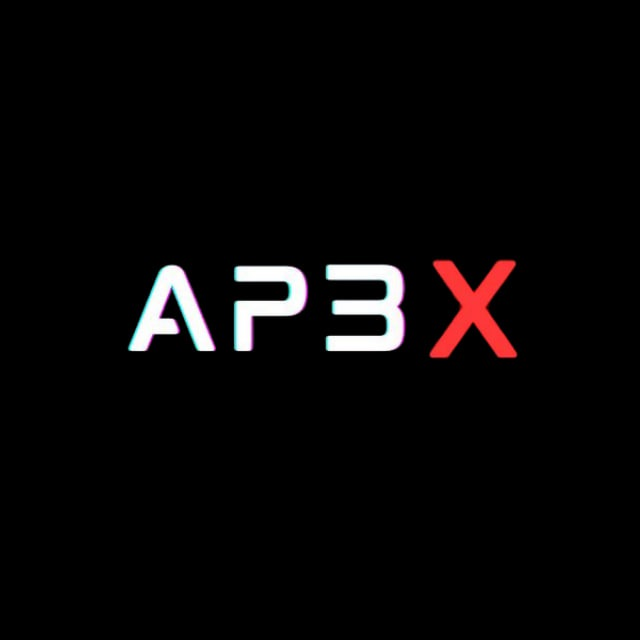

<!-- APΞX PROFILE (Black/White/Grey/Red Theme) -->
<div align="center">

<!-- HERO BANNER (AP3X.png) -->


</div>

---

<div align="center">

# <span style="color:#ff2323; font-weight: bold;">Boosting Blockchain & AI Reality</span>

> <span style="color:#fff; font-size:1.1em;">Architecting neural-powered, decentralized protocols. Welcome to the future.</span>

</div>

---

<div align="center">

<table><tr><td width="100%" align="center" style="background:#222; border-radius:16px; padding:20px 0 12px 0; box-shadow:0 0 12px #222;">

### <span style="color:#ff2323;">Core Skills</span>
- Blockchain Architecture (Solana, Ethereum, Rust, Solidity)
- DeFi Protocol Design & Security Auditing
- AI/ML Integration & Neural Networks
- High-Performance Smart Contracts
- Web3 Infrastructure & Automation

</td></tr></table>

</div>

---

<details>
<summary><span style="color:#ff2323; font-weight:bold;"> Terminal (click to expand)</span></summary>

```
APΞX@matrix:~$ whoami
 Blockchain Architect | AI Dev | Protocol Engineer

APΞX@matrix:~$ ./activate_god_mode.sh
[■■■■■■■■■■■■■■■■■■■■■■■■] 100% Synced
> Welcome. System: Online.

APΞX@matrix:~$ echo "Build. Ship. Disrupt."
Build. Ship. Disrupt.
```

</details>

---

<div align="center">

<table><tr>
<td width="48%" align="center" style="background:#222; border-radius:16px; padding:16px; box-shadow:0 0 12px #222; vertical-align:top;">

[](https://github.com/AP3X-Dev/Solana-Casino)


### **Infrastructure**


</div>

---

## 🎯 **Boosted Tokens Radar**

<div align="center">

### ⚡ **High-Performance Token Scanner**

</div>

<table>
<tr>
<td width="100%">

```javascript
// Real-time token boost scanner - DexScreener API Integration
const scanHighBoostTokens = async () => {
  const response = await fetch('https://api.dexscreener.com/token-boosts/top/v1');
  const tokens = await response.json();
  
  return tokens
    .filter(token => token.totalAmount >= 500)
    .map(token => ({
      symbol: token.description?.split(' ')[0] || 'UNKNOWN',
      chain: token.chainId.toUpperCase(),
      boosts: token.totalAmount,
      status: token.totalAmount > 1000 ? 'MAXIMUM' : 'HIGH'
    }));
};

console.log('🎯 Scanning for high-energy tokens...');
console.log('⚡ Filter: 500+ boosts threshold');
console.log('💎 Status: MONITORING ACTIVE');
```

### 📊 **Market Intelligence Dashboard**

| 🎯 **Metric** | ⚡ **Status** | 💎 **Value** |
|--------------|-------------|-------------|
| Scanner Status | 🟢 ACTIVE | Real-time |
| Boost Threshold | 🔥 500+ | Elite Tier |
| Data Source | 🌐 DexScreener | Live API |
| Update Frequency | ⚡ 60 seconds | Optimized |

</td>
</tr>
</table>

---

## 🚀 **Featured Projects**

<div align="center">

### 💎 **Portfolio Highlights**

</div>

<table>
<tr>
<td width="50%">

[](https://github.com/AP3X-Dev/Solana-Casino)

**🎰 Revolutionary DeFi Gaming Platform**
- 💰 TVL: $500K+ Locked
- 🎯 Users: 10K+ Active Players
- ⚡ Performance: <100ms Latency

</td>
<td width="50%">

[](https://github.com/AP3X-Dev/SOL-CHAT)

**💬 Decentralized Communication Protocol**
- 🔒 End-to-End Encryption
- 💎 NFT Access Control
- 🌍 Multi-Chain Support

</td>
</tr>
</table>

---

## 📊 **GitHub Analytics**

<table>
<tr>
<td width="50%">


</td>
<td width="50%">


</td>
</tr>
</table>

<div align="center">

[](https://github.com/AP3X-Dev)

</div>

---

## 🌐 **Connect**

<div align="center">

### 🔗 **Professional Networks**

[](https://github.com/AP3X-Dev)
[](https://twitter.com/AP3X_Dev)
[](https://discord.gg/ap3x)
[](https://linkedin.com/in/ap3x-dev)

### 📧 **Business Inquiries**
[](mailto:contact@ap3x.dev)
[](https://calendly.com/ap3x-dev)

---

### 🚀 **Ready to Build the Future?**

```bash
> Seeking innovative DeFi partnerships
> Expertise in Solana ecosystem development  
> Available for consulting and collaboration
> Response time: <24 hours
```


**⚡ Powered by Innovation • Secured by Blockchain • Driven by Passion ⚡**

</div>
